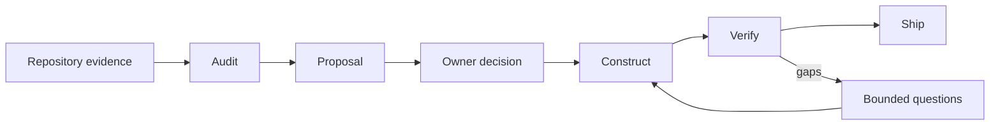
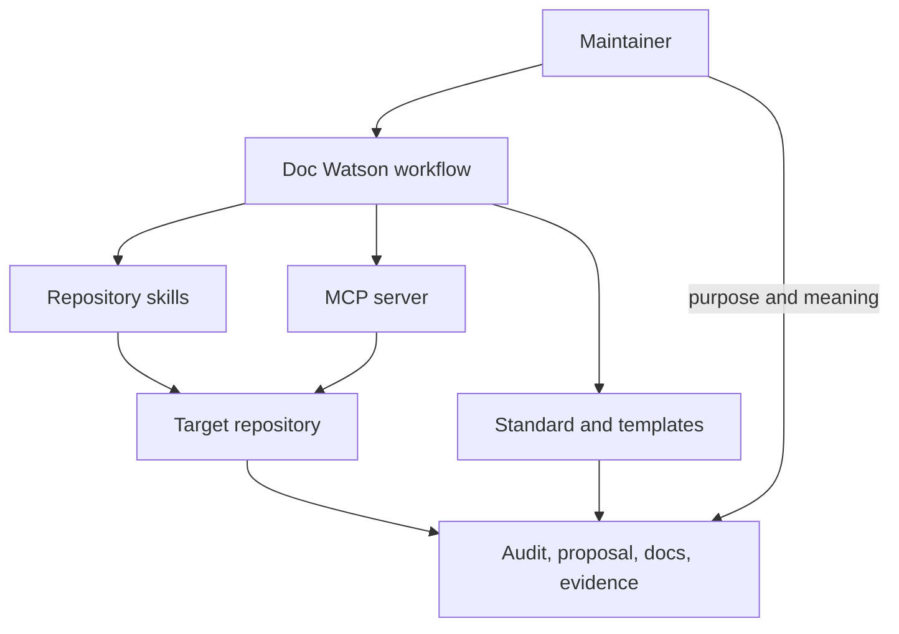

# Doc Watson

Repository documentation from evidence.

Doc Watson is built to inspect a software repository, decide how much
documentation it has earned, propose a coherent structure, and help construct
truthful docs from code, configuration, tests, workflows, releases, and owner
input. Which parts exist today is recorded in the
[architecture note](docs/architecture.md). Its
first audience is the individual maintainer working interactively with an
agent: useful documentation without generic boilerplate or confident guesses.
Team-wide CI enforcement is a later integration, not the initial default.

> **Status:** early working product. The standard, workflow, and first
> repository skills are present. The MCP server
> ([#3](https://github.com/dhk/doc-watson/issues/3)) is separate work.

## Why this exists

A repository can contain a great deal of writing and still be poorly
documented when there is no clear way into it. Adding every familiar
open-source document to a small script creates a different problem: maintenance
without reader value.

Doc Watson treats documentation as an evidence and information-architecture
problem. It scales depth to the repository, distinguishes current facts from
proposals, validates executable claims, and records unknowns rather than
completing them with plausible fiction.

## The workflow

1. **Audit** the repository, its docs, and its external surfaces.
2. **Propose** a right-sized level and file-level after-state.
3. **Decide** scope with the owner, asking only for facts the repository cannot
   establish.
4. **Construct** documentation from evidence and confirmed owner knowledge.
5. **Verify** commands, links, diagrams, claims, and hygiene.
6. **Ship** an attributable before/after change with gaps preserved.

See the [complete workflow](docs/workflow.md) and [evidence model](docs/evidence.md).

## Documentation levels

| Level | Typical repository |
| ----- | ------------------------------------------ |
| 0     | Experiment, personal script, or archive    |
| 1     | Active early tool or library               |
| 2     | Mature system or service                   |
| 3     | Credible public OSS with outside consumers |

What each level requires, concern by concern, is defined only in the
[standard](docs/standard.md#levels); levels are baselines, not cumulative.

Documents are triggered by real needs, not level alone. Runbooks exist because
alerts page someone; governance exists because maintainers share authority;
machine contracts exist because a tool parses the repository.

Read the [versioned standard](docs/standard.md). Starting structures live in
[`templates/`](templates/).

## Architecture

The [architecture note](docs/architecture.md) records which of these surfaces
are present and which are proposed.

## Skills

| Skill | Current job |
|---|---|
| [`repo-doc-audit`](skills/repo-doc-audit/SKILL.md) | Inspect without changing the target; produce evidence, level decision, scorecard, and before-state |
| [`repo-doc-propose`](skills/repo-doc-propose/SKILL.md) | Turn accepted findings into a bounded, approval-gated documentation plan |
| [`repo-doc-construct`](skills/repo-doc-construct/SKILL.md) | Implement approved documentation, run authorized checks, and report the before/after delta |

The stages remain separate so inspection does not imply mutation, and a
documentation edit does not imply publication or merge authority.

## Current deliverables

- [repository documentation standard](docs/standard.md);
- [audit-to-ship workflow](docs/workflow.md);
- provenance-preserving [evidence model](docs/evidence.md);
- reusable [document templates](templates/README.md);
- composable [audit](skills/repo-doc-audit/SKILL.md),
  [proposal](skills/repo-doc-propose/SKILL.md), and
  [construction](skills/repo-doc-construct/SKILL.md) skills;
- [prior-art and adaptation record](docs/prior-art.md).

## Contributing

Doc Watson is early. Discuss material changes to the standard, evidence
vocabulary, or public interfaces in an issue first. See
[CONTRIBUTING.md](CONTRIBUTING.md).

## License

[MIT](LICENSE)
