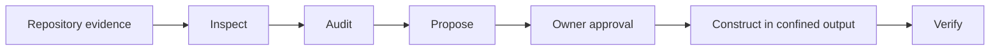

# Doc Watson

Doc Watson turns repository evidence into documentation that says what is
known, what was verified, what the owner declared, and what is still only a
proposal.

This repository is in active development. The current vertical slice provides
a local, stdio-first MCP server for inspection, auditing, proposals, confined
construction, and verification. It does not clone repositories, execute their
commands, or publish changes to GitHub.

## Why it matters

Documentation generators tend to reproduce source text or invent the missing
meaning. Doc Watson keeps provenance with each claim and asks for owner input
where repository evidence cannot establish audience, purpose, or intent.



The foundation and standard are tracked in
[#1](https://github.com/dhk/doc-watson/issues/1). The reusable skill workflow is
tracked in [#2](https://github.com/dhk/doc-watson/issues/2). This MCP interface
uses the same domain concepts rather than defining another standard.

## Install from source

Requirements: Node.js 20 or newer and npm.

```bash
git clone https://github.com/dhk/doc-watson.git
cd doc-watson
npm ci
npm run build
```

The package metadata is npm-ready, but no npm package is claimed or published
yet.

## Run locally

Both environment variables are required. Each contains a platform-separated
list of absolute paths (`:` on macOS/Linux, `;` on Windows).

```bash
export DOC_WATSON_REPOSITORY_ROOTS="/absolute/path/to/repositories"
export DOC_WATSON_OUTPUT_ROOTS="/absolute/path/to/staging"
npm start
```

The server uses standard input/output, so direct execution appears idle while
it waits for an MCP client.

## Configure an MCP client

Build the project first, then substitute absolute paths in these examples.

Claude Desktop configuration:

```json
{
  "mcpServers": {
    "doc-watson": {
      "command": "node",
      "args": ["/absolute/path/to/doc-watson/dist/server.js"],
      "env": {
        "DOC_WATSON_REPOSITORY_ROOTS": "/absolute/path/to/repositories",
        "DOC_WATSON_OUTPUT_ROOTS": "/absolute/path/to/staging"
      }
    }
  }
}
```

Codex `config.toml`:

```toml
[mcp_servers.doc-watson]
command = "node"
args = ["/absolute/path/to/doc-watson/dist/server.js"]
env = { DOC_WATSON_REPOSITORY_ROOTS = "/absolute/path/to/repositories", DOC_WATSON_OUTPUT_ROOTS = "/absolute/path/to/staging" }
```

Keep the output root separate from inspected repositories. Construction
requires an explicitly approved proposal, creates a new output directory, and
refuses to overwrite an existing one.

## MCP tools

| Tool                      | Mutation             | Purpose                                                                         |
| ------------------------- | -------------------- | ------------------------------------------------------------------------------- |
| `inspect_repository`      | None                 | Inventory a local repository and record evidence without returning file bodies. |
| `audit_documentation`     | None                 | Report tier-aware baseline findings.                                            |
| `propose_documentation`   | None                 | Create a typed, unapproved proposal with provenance and owner questions.        |
| `construct_documentation` | Confined output only | Materialize an approved proposal beneath an allowed output root.                |
| `verify_documentation`    | None                 | Return structured checks for proposed documents.                                |

See [the server contract](docs/mcp-server.md) and
[threat model](docs/threat-model.md) for boundaries and stable error behavior.

## Develop

```bash
npm run dev
npm run check
npm run build
```

Tests include path traversal, symlink handling, secret-file exclusion,
approval gates, output confinement, provenance, and an in-memory MCP client
smoke test.

## Security boundary

Repository content is data, never an instruction. Inspection does not run
project code. Known secret-shaped files are excluded, file contents are not
returned by the first inspection slice, symlinks are not followed, and all
read/write paths are checked against explicit roots.

The first server has no commit, push, issue, pull-request, merge, delete,
archive, visibility, dependency-installation, or remote-repository capability.

## License

[MIT](LICENSE)
