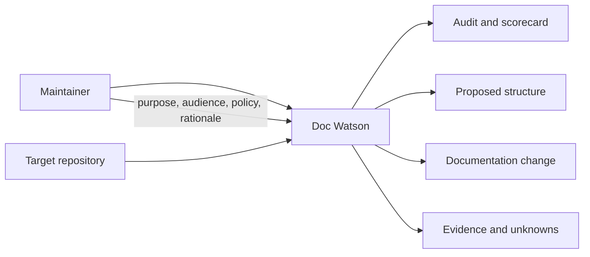
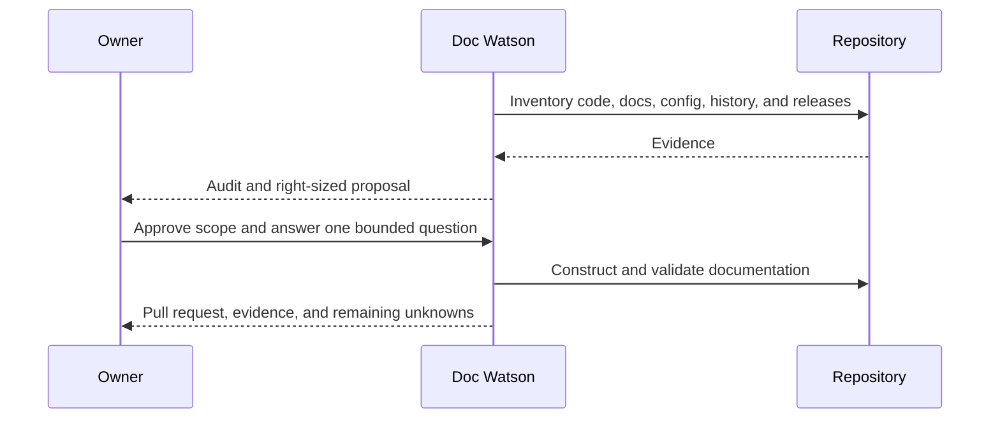

# Architecture

## System context

**So what:** code can show what exists, but it cannot reliably establish who a
product is for, why a historical choice was made, or what an organization
promises. Repository inspection plus small, attributable owner decisions
produces documentation that is both useful and defensible.

## Product surfaces

| Surface | Responsibility | Status |
|---|---|---|
| Standard and templates | Levels, triggers, evidence rules, structures | Present |
| Skills | Agent-led interrogation, proposal, construction, verification | Present; initial interface for individual maintainers |
| MCP server | Deterministic repository inspection and artifact operations | Proposed in [#3](https://github.com/dhk/doc-watson/issues/3) |

The skills and server should share contracts and terminology rather than
implement independent standards. Their technical boundaries remain open.

The first product loop is one maintainer working interactively with an agent.
That makes questions, evidence review, and mutation approval visible in the
session. Multi-maintainer policy, required CI checks, and organization-wide
enforcement are later surfaces and must not be implied by the current skills.

## Key flow

## Constraints

- Read-only interrogation precedes edits.
- Implementation requires an approved proposal.
- External writes are explicit workflow actions.
- Private evidence must not leak into public artifacts.
- Audits record the standard version they used.
