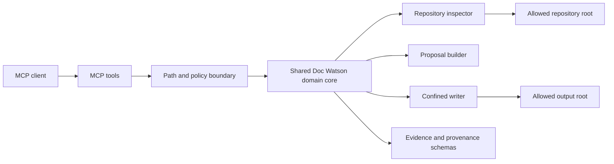
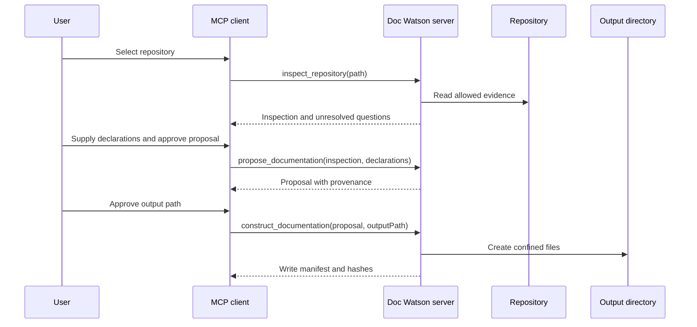

# Doc Watson MCP server

This document defines the contract and local setup for exposing Doc Watson to
MCP clients. The initial tools are implemented in TypeScript using the official
MCP SDK and operate over standard input/output.

## Purpose

The server lets an MCP client inspect a local repository, assemble evidence,
and draft a documentation proposal without granting the model unrestricted
filesystem access. The user remains responsible for approving any generated
files before they replace repository documentation.

The first vertical slice is deliberately small:

1. `inspect_repository` inventories a repository and records evidence.
2. `audit_documentation` assesses the evidence against a requested level.
3. `propose_documentation` turns an inspection into a documentation proposal.
4. `construct_documentation` writes approved generated files beneath one
   explicit output directory.
5. `verify_documentation` returns structured checks for a proposal.

Issue [#1](https://github.com/dhk/doc-watson/issues/1) defines the documentation
standard. Issue [#2](https://github.com/dhk/doc-watson/issues/2) defines the
corresponding skill workflow. The MCP server is a transport and safety boundary
around the same domain model; it must not create a second standard.

## Architecture



The domain core must not depend on MCP request or response objects. CLI, skill,
and MCP adapters should call the same inspection, proposal, and rendering
functions so that findings do not drift between interfaces.

## Tool contracts

### `inspect_repository`

Input:

- `repositoryPath`: absolute path to an existing local repository beneath a
  configured repository root.

Output:

- a versioned inspection document conforming to
  [`schemas/inspection.schema.json`](../schemas/inspection.schema.json);
- warnings for unreadable, excluded, binary, or oversized content;
- no file writes.

### `audit_documentation`

Input: a validated inspection and documentation level. Output: stable finding
codes and severity. It performs no file writes.

Current scope: file presence for `README.md` (required at every level) and
`LICENSE` (a warning only at Level 3, per the standard). It does not yet score
the standard's audit concerns.

### `propose_documentation`

Input:

- an inspection document;
- requested documentation level;
- optional owner-supplied declarations.

Output:

- a versioned proposal conforming to
  [`schemas/proposal.schema.json`](../schemas/proposal.schema.json);
- every claim associated with provenance;
- unresolved questions kept as questions, never filled with guesses;
- no file writes.

### `construct_documentation`

Input:

- a validated proposal;
- an absolute `outputPath` beneath a configured output root.

Output:

- manifest of created, skipped, and rejected paths;
- content hashes for created files;
- no writes outside `output_path`.

It renders to a staging directory and must not edit the inspected repository.

### `verify_documentation`

Input: a validated proposal. Output: structured pass/fail checks per document.
Verification is read-only and the first slice does not execute repository
commands.

## Provenance

Every consequential statement must be classified as one of:

- `observed`: directly supported by a repository artifact;
- `verified`: confirmed by executing a recorded check;
- `declared`: supplied by the repository owner;
- `proposed`: a recommendation, not current behaviour;
- `unknown`: requires a decision or more evidence.

An evidence reference records a repository-relative path, optional line range,
content hash, and short excerpt or check result. Absolute local paths must not
appear in generated public documentation.

## Processing sequence



## Install and run

Node.js 20 or newer is required. The package is not yet published to npm.

```bash
git clone https://github.com/dhk/doc-watson.git
cd doc-watson
npm ci
npm run build
```

Set explicit roots before starting the stdio server. Multiple roots use `:` on
macOS/Linux and `;` on Windows.

```bash
export DOC_WATSON_REPOSITORY_ROOTS="/absolute/path/to/repositories"
export DOC_WATSON_OUTPUT_ROOTS="/absolute/path/to/staging"
npm start
```

## Client configuration

Claude Desktop configuration:

```json
{
  "mcpServers": {
    "doc-watson": {
      "command": "node",
      "args": ["/absolute/path/to/doc-watson/dist/server.js"],
      "env": {
        "DOC_WATSON_REPOSITORY_ROOTS": "/absolute/path/to/repositories",
        "DOC_WATSON_OUTPUT_ROOTS": "/absolute/path/to/staging"
      }
    }
  }
}
```

Codex `config.toml`:

```toml
[mcp_servers.doc-watson]
command = "node"
args = ["/absolute/path/to/doc-watson/dist/server.js"]
env = { DOC_WATSON_REPOSITORY_ROOTS = "/absolute/path/to/repositories", DOC_WATSON_OUTPUT_ROOTS = "/absolute/path/to/staging" }
```

Keep credentials out of arguments and configuration. Use absolute local paths,
but do not copy author-specific paths into public documentation.

## Definition of done for the first slice

- All five tools return structured, schema-validated responses.
- Path traversal and symlink escapes are rejected by tests.
- Repository inspection performs no writes.
- Documentation writes are confined to a separate output root and do not
  overwrite by default.
- The fixture repository produces deterministic inspection and proposal data.
- CI runs formatting, static checks, unit tests, and an MCP smoke test.
- Setup instructions work from a fresh checkout.
