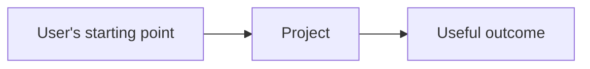

# [Project name]

[What it is, who it is for, and the useful change it makes.]

> **Status:** [What works now; what is experimental or planned.]

## Quickstart

```text
[Smallest verified path to a successful outcome]
```

[Expected result and how to recognize it.]

## How it works



[Explain the consequence, not merely the technologies.]

## Documentation

- `docs/guide/getting-started.md`
- `docs/reference/README.md`
- `docs/architecture/README.md`

Include only links that exist.

## Limitations and safety

- [Unsupported case, data boundary, credential risk, or side effect]

## Contributing

See `CONTRIBUTING.md`.

## License

[SPDX identifier] — see `LICENSE`.
