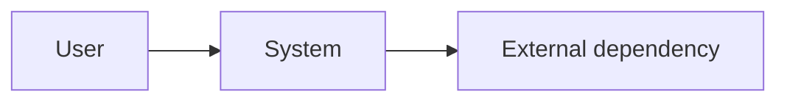
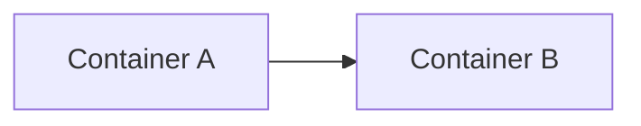
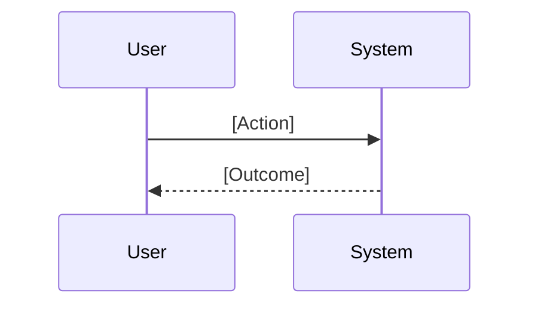

# Architecture

## System context

[Who uses the system, what it interacts with, and why.]

**So what:** [How this changes the user's situation.]

## Containers

| Container | Responsibility       |
| --------- | -------------------- |
| A         | [One responsibility] |
| B         | [One responsibility] |

## Key flow

## Constraints, risks, and unknowns

- [Evidence-backed constraint, risk, or explicit unknown]
